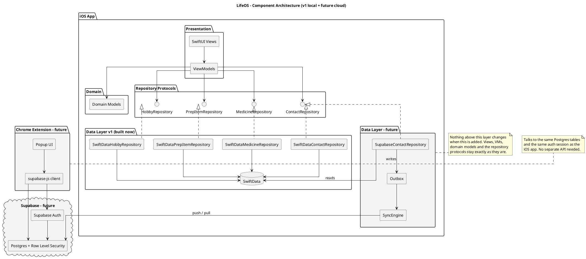
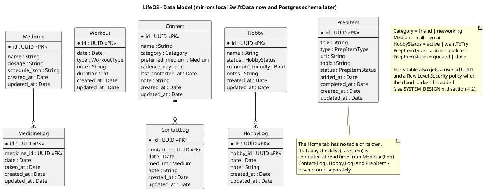
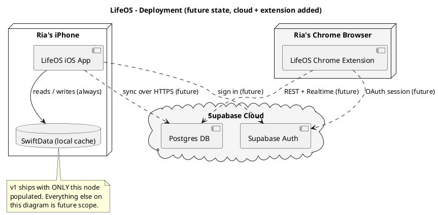

# LifeOS — High-Level Design (HLD)

**Status:** Draft v1
**Companion to:** [`SYSTEM_DESIGN.md`](SYSTEM_DESIGN.md) (the written
rationale) — this document is the diagram set. Source `.puml` files live in
[`docs/diagrams/`](diagrams) so they can be edited and re-rendered
independently of this write-up.

## How to render these

The diagrams are plain [PlantUML](https://plantuml.com) — no build step is
required to read the source, but to view them as pictures, any of these
work:

- **VS Code**: install the "PlantUML" extension (jebbs.plantuml), open any
  `.puml` file, `Alt+D` to preview.
- **Online, no install**: paste a `.puml` file's contents into
  [plantuml.com/plantuml](https://www.plantuml.com/plantuml/uml/).
- **CLI** (if you want PNGs committed to the repo later): `brew install
  plantuml` then `plantuml docs/diagrams/*.puml` generates `.png` next to
  each source file.
- **IntelliJ / Xcode**: JetBrains has a PlantUML plugin; there's no native
  Xcode preview, VS Code or the web viewer are the easiest path.

Note: GitHub does **not** render ` ```plantuml ` code fences as images on its
own (it only auto-renders Mermaid) — the blocks below are the readable
source, not a live diagram. If you want diagrams that render automatically
on GitHub, the follow-up would be a small GitHub Action
(e.g. `plantuml-action`) that converts `docs/diagrams/*.puml` to `.svg` on
push and commits them — flagged as a nice-to-have, not done yet.

---

## 1. Component Architecture

Shows the layering from `SYSTEM_DESIGN.md` §2 as a diagram: shaded boxes are
**future** (cloud backend, Chrome extension), everything else is **built in
v1**. The key thing this diagram is meant to make visually obvious: nothing
above the "Data Layer" packages needs to change when the shaded boxes get
built.

Source: [`docs/diagrams/component-architecture.puml`](diagrams/component-architecture.puml)



---

## 2. Data Model (ERD)

The entity shapes from `SYSTEM_DESIGN.md` §3 and §4.2 — modeled the same way
whether they're SwiftData objects today or Postgres tables later, so this one
diagram describes both.

Source: [`docs/diagrams/data-model-erd.puml`](diagrams/data-model-erd.puml)



---

## 3. Sync Sequence (Future)

Walks through a single write (logging a call) end-to-end once the cloud
backend exists: local-first (instant UI update), queued in an outbox, then
reconciled with Supabase when online. **Not built in v1** — this is the
target behavior for when `SYSTEM_DESIGN.md` §5 gets implemented.

Source: [`docs/diagrams/sync-sequence.puml`](diagrams/sync-sequence.puml)

```plantuml
@startuml sync-sequence
title LifeOS - Local Write and Cloud Sync (future v2 flow, not built in v1)

actor Ria
participant "SwiftUI View" as View
participant "ViewModel" as VM
participant "SupabaseContactRepository" as Repo
database "SwiftData\n(local cache)" as Local
participant "Outbox" as Outbox
participant "SyncEngine" as Sync
cloud "Supabase\n(Postgres + RLS)" as Cloud

Ria -> View : Tap "Log a call"
View -> VM : logContact(contact)
VM -> Repo : logContact(contact)
Repo -> Local : write ContactLog (instant)
Repo -> Outbox : enqueue pending mutation
Repo --> VM : return immediately
VM --> View : UI updates (optimistic,\nfeels as fast as v1)

== later, when online ==

Sync -> Outbox : drain pending mutations
Sync -> Cloud : push ContactLog (upsert)
Cloud --> Sync : ack
Sync -> Outbox : clear entry

Sync -> Cloud : pull changes\nsince last_synced_at
Cloud --> Sync : rows changed by\nother devices/clients
Sync -> Local : merge\n(last-write-wins on updated_at)
Local --> VM : UI reflects\nremote changes

note over Sync, Cloud
  Conflict policy is deliberately simple:
  updated_at last-write-wins. Appropriate
  for single-user personal data - see
  SYSTEM_DESIGN.md section 5.
end note

@enduml
```

---

## 4. Deployment (Future)

Where each piece physically runs once cloud sync and the Chrome extension
exist. In v1, only "Ria's iPhone" is populated — everything else on this
diagram is future scope, shown shaded.

Source: [`docs/diagrams/deployment.puml`](diagrams/deployment.puml)



---

## Change Log

| Date | Change |
|---|---|
| 2026-09-21 | Initial HLD: component architecture, data model ERD, sync sequence, deployment — all PlantUML, all diagram source under `docs/diagrams/` |
| 2026-09-21 | Fixed a syntax error (a `note` referencing a package by its quoted display name instead of an alias) and switched all diagrams to plain ASCII text and explicit aliases throughout, for reliable parsing in any PlantUML renderer |
