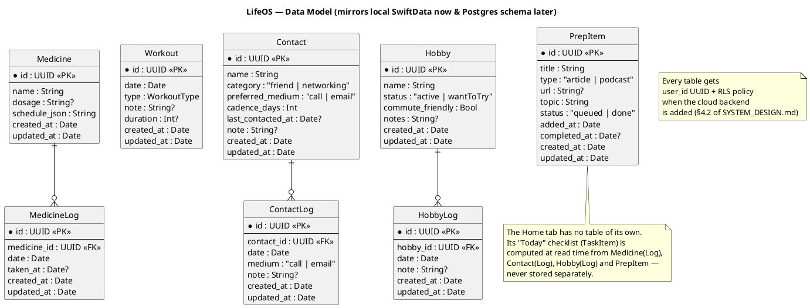
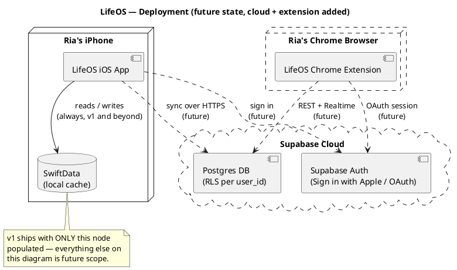

# LifeOS — High-Level Design (HLD)

**Status:** Draft v1
**Companion to:** [`SYSTEM_DESIGN.md`](SYSTEM_DESIGN.md) (the written
rationale) — this document is the diagram set. Source `.puml` files live in
[`docs/diagrams/`](diagrams) so they can be edited and re-rendered
independently of this write-up.

## How to render these

The diagrams are plain [PlantUML](https://plantuml.com) — no build step is
required to read the source, but to view them as pictures, any of these
work:

- **VS Code**: install the "PlantUML" extension (jebbs.plantuml), open any
  `.puml` file, `Alt+D` to preview.
- **Online, no install**: paste a `.puml` file's contents into
  [plantuml.com/plantuml](https://www.plantuml.com/plantuml/uml/).
- **CLI** (if you want PNGs committed to the repo later): `brew install
  plantuml` then `plantuml docs/diagrams/*.puml` generates `.png` next to
  each source file.
- **IntelliJ / Xcode**: JetBrains has a PlantUML plugin; there's no native
  Xcode preview, VS Code or the web viewer are the easiest path.

---

## 1. Component Architecture

Shows the layering from `SYSTEM_DESIGN.md` §2 as a diagram: solid boxes are
**built in v1**, dashed boxes are **future** (cloud backend, Chrome
extension). The key thing this diagram is meant to make visually obvious:
nothing above the "Data Layer" packages needs to change when the dashed
boxes get built.

Source: [`docs/diagrams/component-architecture.puml`](diagrams/component-architecture.puml)

```plantuml
@startuml component-architecture
title LifeOS — Component Architecture (v1 local + future cloud)

skinparam componentStyle rectangle
skinparam linetype ortho

package "iOS App" {
  package "Presentation" {
    [SwiftUI Views] as Views
    [ViewModels] as VMs
  }

  package "Domain" {
    [Domain Models\n(Medicine, Contact, Hobby, PrepItem, ...)] as Domain
  }

  package "Repository Protocols" {
    interface MedicineRepository
    interface ContactRepository
    interface HobbyRepository
    interface PrepItemRepository
  }

  package "Data Layer — v1 (built now)" {
    [SwiftDataMedicineRepository] as SDMed
    [SwiftDataContactRepository] as SDContact
    [SwiftDataHobbyRepository] as SDHobby
    [SwiftDataPrepItemRepository] as SDPrep
    database "SwiftData\n(on-device store)" as SwiftDataDB
  }

  package "Data Layer — future (not built yet)" #line.dashed {
    [SupabaseContactRepository] as SBContact
    [SyncEngine] as Sync
    [Outbox\n(pending mutations)] as Outbox
  }
}

package "Chrome Extension — future" #line.dashed {
  [Popup UI] as ExtUI
  [supabase-js client] as ExtClient
}

cloud "Supabase — future" #line.dashed {
  [Postgres + Row Level Security] as Postgres
  [Supabase Auth] as Auth
}

Views --> VMs
VMs --> Domain
VMs --> MedicineRepository
VMs --> ContactRepository
VMs --> HobbyRepository
VMs --> PrepItemRepository

MedicineRepository <|.. SDMed
ContactRepository <|.. SDContact
HobbyRepository <|.. SDHobby
PrepItemRepository <|.. SDPrep

SDMed --> SwiftDataDB
SDContact --> SwiftDataDB
SDHobby --> SwiftDataDB
SDPrep --> SwiftDataDB

ContactRepository <|.. SBContact : "future swap-in,\nsame protocol"
SBContact --> SwiftDataDB : reads (offline cache)
SBContact --> Outbox : writes (queued)
Outbox --> Sync
Sync --> Postgres : push / pull

ExtUI --> ExtClient
ExtClient --> Postgres : same tables,\nsame RLS
ExtClient --> Auth

Auth --> Postgres : "user_id = auth.uid()"

note right of "Data Layer — future (not built yet)"
  Nothing above this layer changes
  when this is added — Views, VMs,
  Domain models and the repository
  protocols stay exactly as they are.
end note

@enduml
```

---

## 2. Data Model (ERD)

The entity shapes from `SYSTEM_DESIGN.md` §3 and §4.2 — modeled the same way
whether they're SwiftData objects today or Postgres tables later, so this one
diagram describes both.

Source: [`docs/diagrams/data-model-erd.puml`](diagrams/data-model-erd.puml)



---

## 3. Sync Sequence (Future)

Walks through a single write (logging a call) end-to-end once the cloud
backend exists: local-first (instant UI update), queued in an outbox, then
reconciled with Supabase when online. **Not built in v1** — this is the
target behavior for when `SYSTEM_DESIGN.md` §5 gets implemented.

Source: [`docs/diagrams/sync-sequence.puml`](diagrams/sync-sequence.puml)

```plantuml
@startuml sync-sequence
title LifeOS — Local Write & Cloud Sync (future v2 flow, not built in v1)

actor Ria
participant "SwiftUI View" as View
participant "ViewModel" as VM
participant "SupabaseContactRepository" as Repo
database "SwiftData\n(local cache)" as Local
participant "Outbox" as Outbox
participant "SyncEngine" as Sync
cloud "Supabase\n(Postgres + RLS)" as Cloud

Ria -> View : Tap "Log a call"
View -> VM : logContact(contact)
VM -> Repo : logContact(contact)
Repo -> Local : write ContactLog (instant)
Repo -> Outbox : enqueue pending mutation
Repo --> VM : return immediately
VM --> View : UI updates (optimistic,\nfeels as fast as v1)

== later, when online ==

Sync -> Outbox : drain pending mutations
Sync -> Cloud : push ContactLog (upsert)
Cloud --> Sync : ack
Sync -> Outbox : clear entry

Sync -> Cloud : pull changes\nsince last_synced_at
Cloud --> Sync : rows changed by\nother devices/clients
Sync -> Local : merge\n(last-write-wins on updated_at)
Local --> VM : (via observation) UI reflects\nremote changes

note over Sync, Cloud
  Conflict policy is deliberately simple:
  updated_at last-write-wins. Appropriate
  for single-user personal data — see
  SYSTEM_DESIGN.md §5.
end note

@enduml
```

---

## 4. Deployment (Future)

Where each piece physically runs once cloud sync and the Chrome extension
exist. In v1, only the "Ria's iPhone" node is populated — everything else on
this diagram is future scope, shown dashed.

Source: [`docs/diagrams/deployment.puml`](diagrams/deployment.puml)



---

## Change Log

| Date | Change |
|---|---|
| 2026-09-21 | Initial HLD: component architecture, data model ERD, sync sequence, deployment — all PlantUML, all diagram source under `docs/diagrams/` |
