# LifeOS walkthrough

One pass through a day in LifeOS, recorded in the iOS Simulator (iPhone 17,
iOS 26) from the built-in sample data. Each screenshot shows the screen
*after* the step in its caption.

## Home: the day starts

<table>
<tr>
<td width="33%">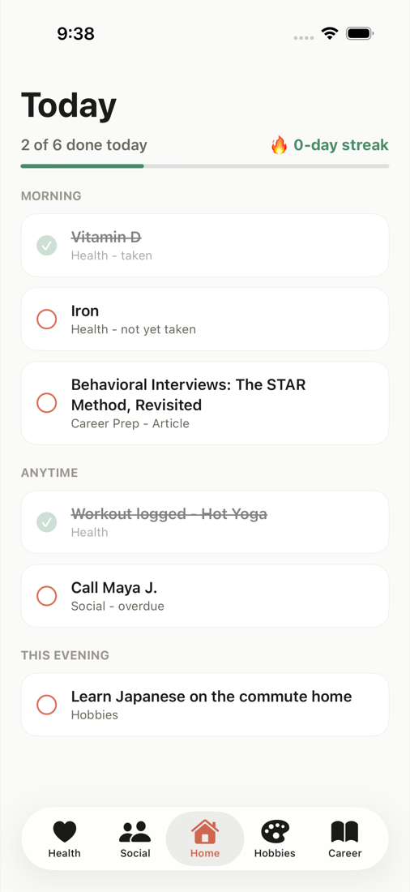</td>
<td valign="top">
<b>1. Today</b><br>
The Home tab opens with a checklist that pulls one or two items from every
other tab: medicines due, today's workout, who to call, the morning read and
tonight's hobby. Two of six are already done.
</td>
</tr>
</table>

## Health: medicines, workout and streak

<table>
<tr>
<td align="center" width="33%">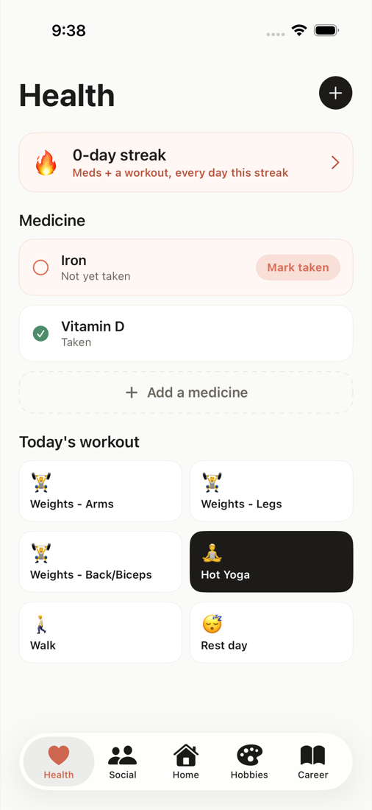<br><sub><b>2.</b> Iron is still due. Hot Yoga is already logged.</sub></td>
<td align="center" width="33%">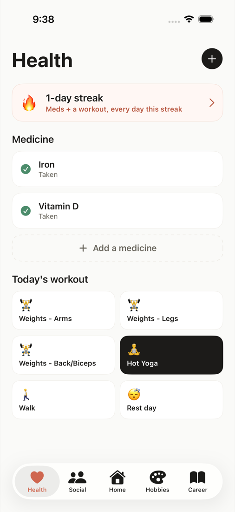<br><sub><b>3.</b> Tap <b>Mark taken</b>. All medicines and a workout are done, so the streak goes to 1 day.</sub></td>
<td align="center" width="33%">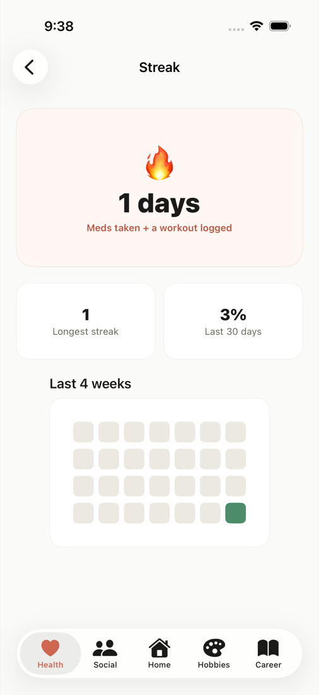<br><sub><b>4.</b> Tap the streak banner for the longest streak, the 30-day rate and a 4-week heatmap.</sub></td>
</tr>
<tr>
<td align="center">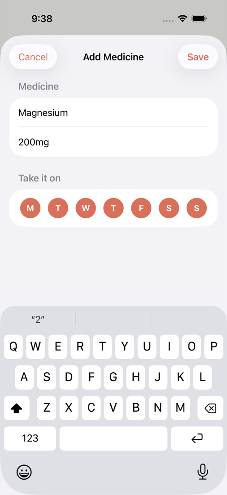<br><sub><b>5.</b> Tap <b>Add a medicine</b>: name, optional dosage, and which weekdays to take it.</sub></td>
<td align="center">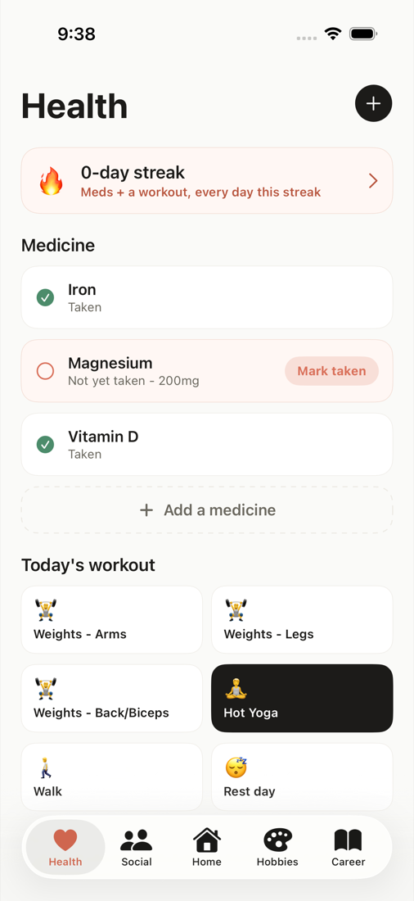<br><sub><b>6.</b> Magnesium 200mg is due today, so the streak drops back to 0 until it's taken.</sub></td>
<td></td>
</tr>
</table>

## Social: who to catch up with

<table>
<tr>
<td align="center" width="25%">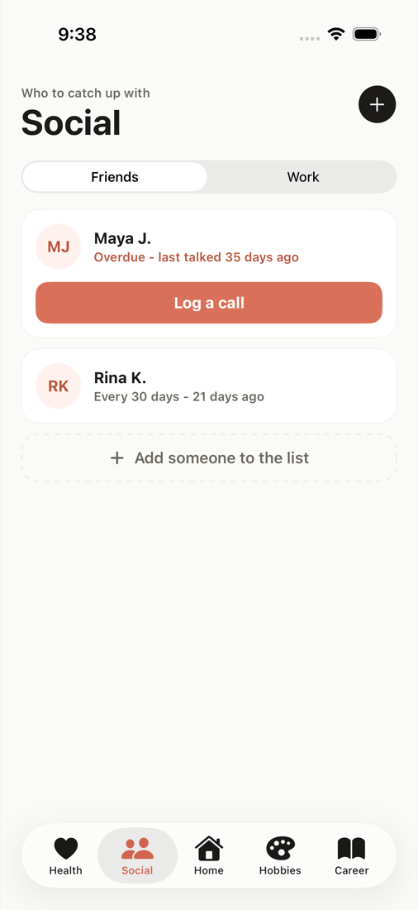<br><sub><b>7.</b> Most overdue first. Maya was last called 35 days ago.</sub></td>
<td align="center" width="25%">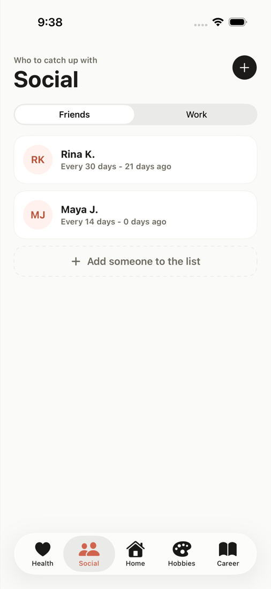<br><sub><b>8.</b> Tap <b>Log a call</b>. Maya resets to 0 days ago.</sub></td>
<td align="center" width="25%">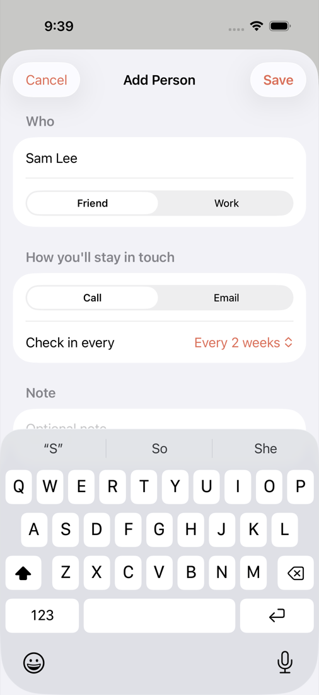<br><sub><b>9.</b> <b>Add someone</b>: name, friend or work, call or email, and how often to check in.</sub></td>
<td align="center" width="25%">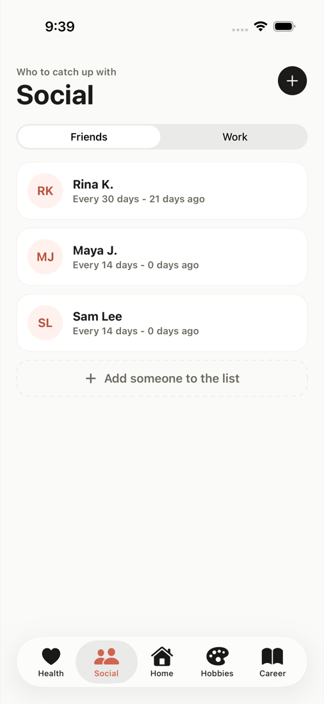<br><sub><b>10.</b> Sam Lee joins the list.</sub></td>
</tr>
</table>

## Hobbies: tonight's commute

<table>
<tr>
<td align="center" width="33%">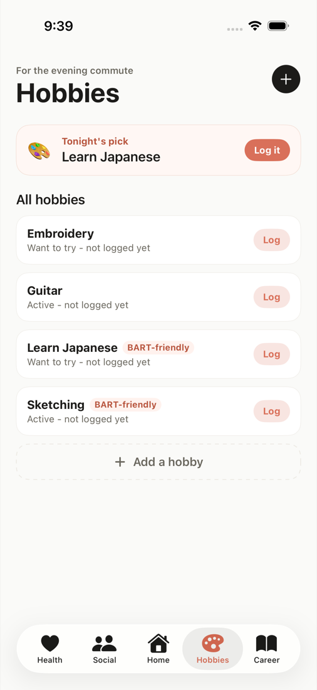<br><sub><b>11.</b> Tonight's pick is the commute-friendly hobby done least recently: Learn Japanese.</sub></td>
<td align="center" width="33%">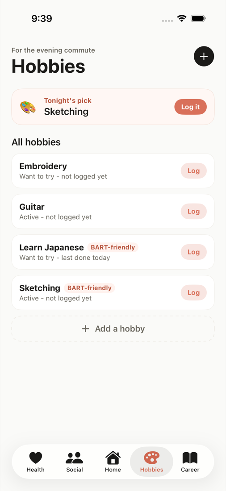<br><sub><b>12.</b> Tap <b>Log it</b>. The pick moves on to Sketching.</sub></td>
<td></td>
</tr>
</table>

## Career Prep: the morning read

<table>
<tr>
<td align="center" width="25%">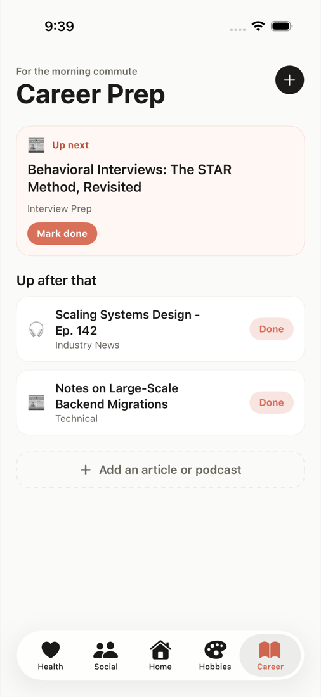<br><sub><b>13.</b> Up next is the STAR-method article, with the rest of the queue below.</sub></td>
<td align="center" width="25%">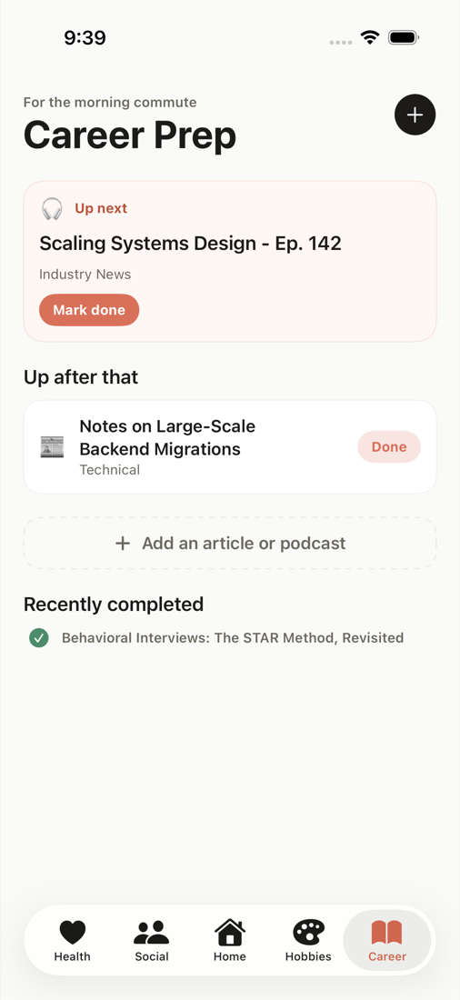<br><sub><b>14.</b> Tap <b>Mark done</b>. It moves to Recently completed and the podcast is up next.</sub></td>
<td align="center" width="25%">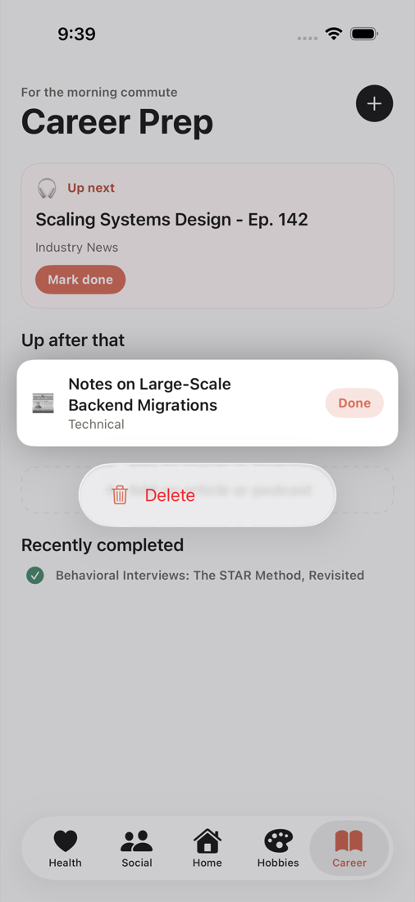<br><sub><b>15.</b> Long-press anything you've added to get <b>Delete</b>.</sub></td>
<td align="center" width="25%">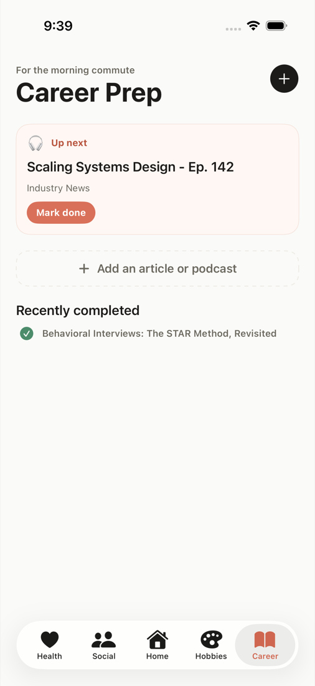<br><sub><b>16.</b> The migrations article is gone.</sub></td>
</tr>
</table>

## Home: end of the run

<table>
<tr>
<td width="33%">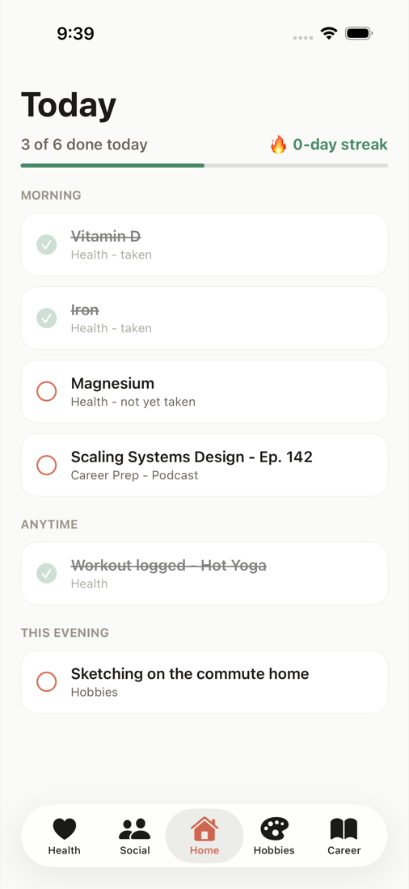</td>
<td valign="top">
<b>17. Today, updated</b><br>
Iron is checked off and Magnesium has joined the morning list. The podcast is
now the morning read and Sketching is tonight's hobby. Maya's call dropped off
because she's no longer overdue.
</td>
</tr>
</table>

## Regenerating these screenshots

The walkthrough is produced by the `/run-lifeos` driver, which runs on macOS
with Xcode. It uses the iPhone 17 simulator so the data on your main
simulator isn't touched:

```bash
export SIM="iPhone 17"
.claude/skills/run-lifeos/driver.sh reset     # wipe the app so sample data loads
.claude/skills/run-lifeos/driver.sh drive "tab:Home;shot:01-home-start;\
tab:Health;shot:02-health;tap:Mark taken;shot:03-health-taken;text:1-day streak;shot:04-streak;back;\
tap:Add a medicine;field:Name;type:Magnesium;field:Dosage (optional);type:200mg;shot:05-add-medicine;tap:Save;shot:06-medicine-added;\
tab:Social;shot:07-social;tap:Log a call;shot:08-social-called;tap:Add someone to the list;field:Name;type:Sam Lee;shot:09-add-person;tap:Save;shot:10-person-added;\
tab:Hobbies;shot:11-hobbies;tap:Log it;shot:12-hobby-logged;\
tab:Career;shot:13-career;tap:Mark done;shot:14-career-done;hold:Notes on Large-Scale Backend Migrations;shot:15-delete-menu;tap:Delete;shot:16-deleted;\
tab:Home;shot:17-home-end"
```

Full-size screenshots land in `$TMPDIR/lifeos-driver/shots/`.
